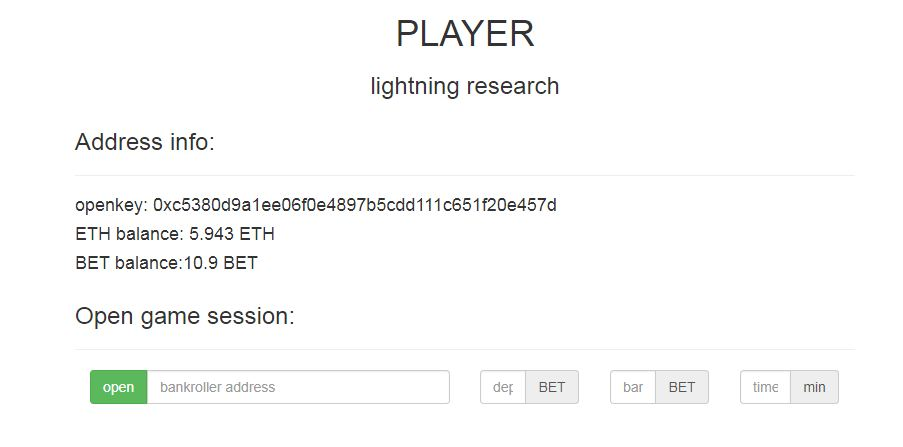
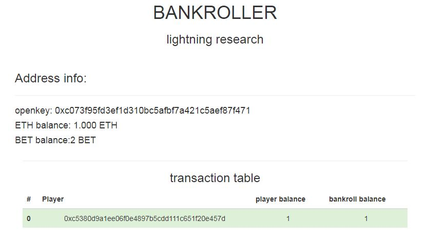

# Lightning Network Experiment

During the research period of Lightning Network implementation, we have created a test prototype for players and bankrollers. 
Smart-contract of our channels interacts only with test tokens(approve required).

## Player
Players interface allows to open channel and refresh the current channel status. 
In any moment player can save channel’s status in blockchain and close it with both sides confirmation. 
After saving, channel status updates in blockchain, contract accepts the latest value.

## Bankroller
Bankroller automatically opens channel by players request and signs latest channel status.

## Messaging
In test prototype we use local server of websockets.

# Game channel
coming soon

